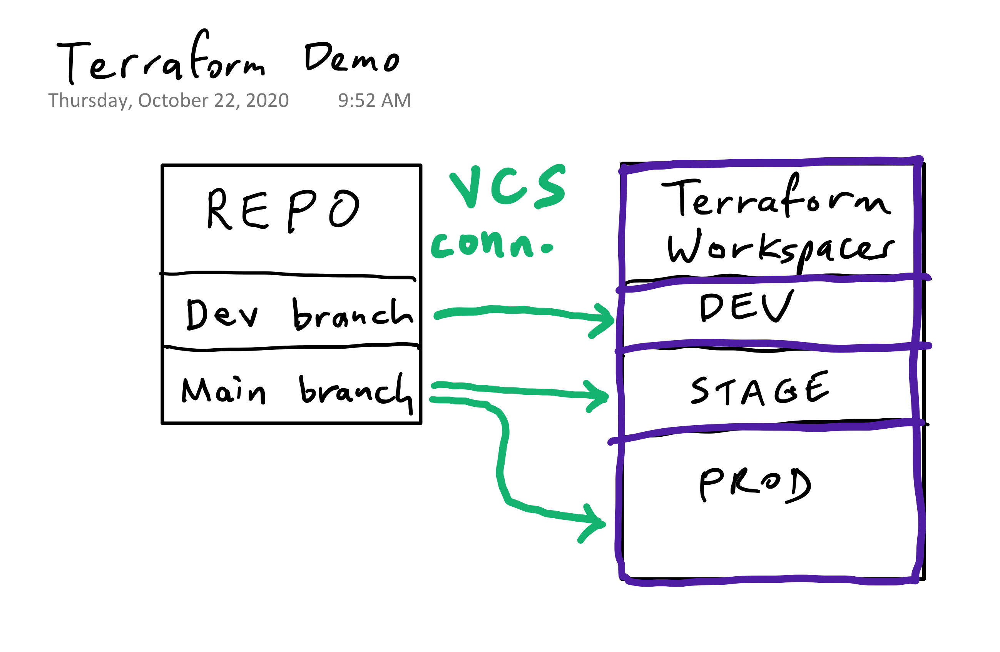

# terraform-demo-azure

## Prerequisites
1. Workspaces created and VCS connections in place on workspaces as follows:

*Test workspace for CLI driven flow with remote backend is optional.*
2. Make sure tfc-agent(s) are running as appropriate.
3. Make sure main.tf is blank in dev and main branches.
4. Open incognito browser window and sign in to GitHub as developer user.
5. Open browser window signed in to Terraform Cloud as myself.

## Demo Script
1. old way (google it) vs new way (go to PMR) -- sign in as dev using SSO
2. select module
3. go to github and show bare repo (this can be auto generated, repo, workspace as a service. put short lived creds in here as well)
4. edit main.tf 9 lines and boom, commit to dev. (this is important because it enables you to map from the changes in git to how it will impact the real life infra)
5. while it’s provisioning show:
* workspaces
* run history
* state history + diffs
* variables
* RBAC
6. now open PR, show speculative plan
7. show and explain sentinel policy as code
8. merge PR, show plans queued in both stage and prod
9. review and apply stage, then later review and apply prod
10. increase CPU, RAM, and/or Disk and repeat
11. destroy from GUI (API script if needed is `~/Developer/destroy.sh hashidemos a-tf-demo-azure-TEST`)

### Sentinel Failures

## Completed Code
```
module "appservice" {
  source  = "app.terraform.io/hashidemos/appservice/azurerm"
  version = "0.0.6"

  app_name    = "ninjas-skunkworks-nginx"
  description = "a skunkworks project"
  environment = var.environment
  owner       = "008103"
}

variable "environment" {}

output "http_addr" { value = module.appservice.azure-appsvc-address }
```
